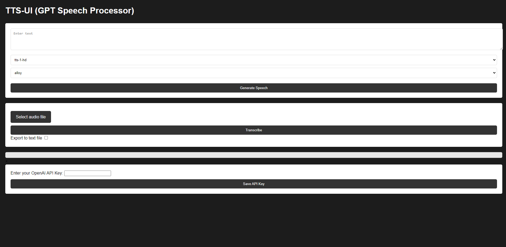

# TTS-UI (GPT Speech Processor) 

## Make sure your API key is set when using the program!

TTS-UI is a web application designed to provide Text-to-Speech (TTS) and Speech-to-Text (STT) services. Users can input text to generate speech or transcribe spoken words into text format.

## Features

- **Text-to-Speech**: Convert your written text into spoken words.
- **Speech-to-Text**: Transcribe audio files into written text.

## Getting Started

### Prerequisites

- Ensure you have a compatible web browser (e.g., Chrome, Firefox).
- Obtain an API key from OpenAI for accessing the speech services.

## Setup and Installation
### Running the Express Server

Before using the TTS-UI application, you need to set up and run the Express server backend that powers the API interactions. 

1. Navigate to the root directory of the project in your terminal.
2. Install the necessary node packages with `npm install`.
3. Start the server using `npm start`
4. The server should be running on `localhost:3000`.

### Accessing the Application

1. Open a web browser and go to `http://localhost:3000/` or the relevant port specified in your server setup.
2. You should now see the `TTS-UI` interface where you can enter text for speech synthesis or transcribe speech from audio files.

### Setting Up Your API Key

1. Scroll to the bottom of the application interface.
2. Enter your OpenAI API key into the `Enter your OpenAI API Key` field.
3. Click `Save API Key` to store and activate your API key for use with the application.

## Usage

### Text-to-Speech

1. Enter the text you wish to convert into the `Enter text` field.
2. (Optional) Select the desired voice model from the dropdown menu.
3. Click `Generate Speech` to create the audio from your text.
4. (Optional) If you want to save the speech as an audio file, check the `Export to text file` option before generating the speech.

### Speech-to-Text

1. Click `Select audio file` to upload the audio file you wish to transcribe.
2. Click `Transcribe` to convert the speech in your audio file to text.

## API Key Security

- Do not share your API key publicly.